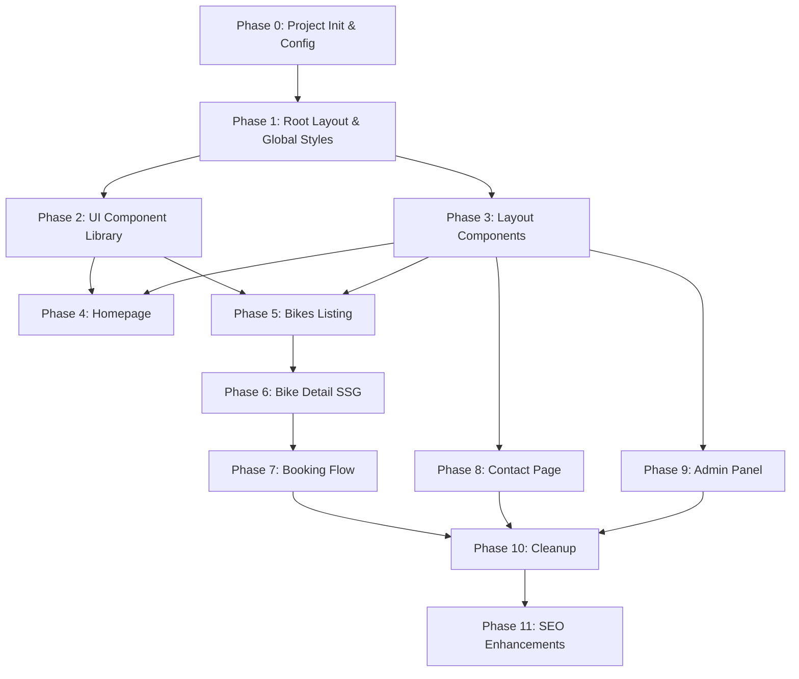

# VietBike: Vite → Next.js Migration & Component Restructuring Plan

## Executive Summary

This document provides a **comprehensive, phase-by-phase migration plan** to convert the VietBike codebase from **Vite + React Router** to **Next.js App Router**, along with a complete **component decomposition strategy** for better maintainability and SEO.

> [!IMPORTANT]
> This plan is designed to be delivered to smaller agents for implementation. Each phase is self-contained with clear inputs, outputs, file lists, and acceptance criteria.

---

## Current State Analysis

### Tech Stack (Before)
| Layer | Current | Target |
|-------|---------|--------|
| Bundler | Vite 6 | Next.js 15 (built-in) |
| Routing | react-router-dom v7 | Next.js App Router |
| Styling | TailwindCSS v4 + @tailwindcss/vite | TailwindCSS v4 + @tailwindcss/postcss |
| State | Zustand | Zustand (keep) |
| Animation | Framer Motion / Motion | Framer Motion (keep) |
| Forms | react-hook-form + zod | react-hook-form + zod (keep) |
| UI Icons | lucide-react | lucide-react (keep) |
| CSS Utilities | clsx + tailwind-merge | clsx + tailwind-merge (keep) |

### Critical Problems Identified

1. **No SSR/SSG** — All pages are client-rendered, invisible to search engines
2. **No meta tags per page** — Single `index.html` with generic title
3. **Monolithic pages** — Homepage: 353 lines, Bikes: 321 lines, Bike Detail: 259 lines, Booking: 429 lines, Admin Vehicles New: 444 lines
4. **Flat component structure** — Only 4 layout components exist, everything else is inlined in page files
5. **Hybrid/broken state** — `app/layout.tsx` uses Next.js imports (`next/font/google`, `Metadata`) but the app actually runs on Vite; some `-content.tsx` files import from `next/navigation` but the active pages use `react-router-dom`
6. **Contact page inlined in `App.tsx`** — Not even a separate component

### File Inventory (32 files)

| Category | Count | Files |
|----------|-------|-------|
| Entry & Config | 5 | `main.tsx`, `App.tsx`, `vite.config.ts`, `index.html`, `package.json` |
| Layouts | 3 | `app/layout.tsx`, `app/(public)/layout.tsx`, `app/admin/layout.tsx` |
| Public Pages | 6 | Homepage, Bikes, Bike Detail, Booking, Confirmation, Contact |
| Content Files (partial Next.js) | 4 | `page-content.tsx`, `detail-content.tsx`, `booking-content.tsx`, `confirmation-content.tsx` |
| Admin Pages | 5 | Dashboard, Vehicles List, Vehicle Add/Edit, Bookings List, New Booking |
| Components | 4 | Navbar, Footer, AdminSidebar, AdminHeader |
| Data & Logic | 6 | 3 mock data files, types, store, utils |
| Styles | 2 | `index.css`, `globals.css` |

---

## New Project Structure (After Migration)

```
src/
├── app/                              # Next.js App Router
│   ├── layout.tsx                    # Root layout (fonts, global meta)
│   ├── globals.css                   # Global styles
│   ├── not-found.tsx                 # 404 page
│   ├── (public)/                     # Public route group
│   │   ├── layout.tsx                # Public layout (Navbar + Footer)
│   │   ├── page.tsx                  # Homepage (SSG, with metadata)
│   │   ├── bikes/
│   │   │   ├── page.tsx              # Bikes listing (SSG + client filters)
│   │   │   └── [slug]/
│   │   │       ├── page.tsx          # Bike detail (SSG with generateStaticParams)
│   │   │       └── bike-detail-client.tsx  # Client-side interactions
│   │   ├── booking/
│   │   │   ├── page.tsx              # Booking flow (client)
│   │   │   └── confirmation/
│   │   │       └── page.tsx          # Confirmation (client)
│   │   └── contact/
│   │       └── page.tsx              # Contact page (SSG with metadata)
│   └── admin/                        # Admin route group
│       ├── layout.tsx                # Admin layout (Sidebar + Header)
│       ├── page.tsx                  # Dashboard
│       ├── vehicles/
│       │   ├── page.tsx              # Vehicles list
│       │   └── new/
│       │       └── page.tsx          # Add vehicle
│       ├── bookings/
│       │   ├── page.tsx              # Bookings list
│       │   └── new/
│       │       └── page.tsx          # New booking
│       ├── customers/
│       │   └── page.tsx              # Placeholder
│       ├── vouchers/
│       │   └── page.tsx              # Placeholder
│       └── finance/
│           └── page.tsx              # Placeholder
│
├── components/                       # ✅ RESTRUCTURED
│   ├── ui/                           # Reusable atomic UI components
│   │   ├── Button.tsx
│   │   ├── Badge.tsx
│   │   ├── Card.tsx
│   │   ├── Select.tsx
│   │   ├── Input.tsx
│   │   ├── Breadcrumbs.tsx
│   │   ├── Pagination.tsx
│   │   ├── ToggleGroup.tsx
│   │   ├── EmptyState.tsx
│   │   └── SectionHeading.tsx
│   │
│   ├── layout/                       # Layout components
│   │   ├── Navbar.tsx
│   │   ├── Footer.tsx
│   │   ├── AdminSidebar.tsx
│   │   └── AdminHeader.tsx
│   │
│   ├── home/                         # Homepage-specific sections
│   │   ├── HeroSection.tsx
│   │   ├── SearchBar.tsx
│   │   ├── FeaturedBikes.tsx
│   │   ├── WhyChooseUs.tsx
│   │   └── CTASection.tsx
│   │
│   ├── bikes/                        # Bikes feature components
│   │   ├── BikeCard.tsx              # Shared bike card (used on home + listing)
│   │   ├── BikeFilterBar.tsx
│   │   ├── BikeGrid.tsx
│   │   ├── BikeGallery.tsx           # Image gallery for detail page
│   │   ├── BikeSpecs.tsx
│   │   ├── BikeFeatures.tsx
│   │   └── BookingCard.tsx           # Sidebar CTA on detail page
│   │
│   ├── booking/                      # Booking flow components
│   │   ├── BookingStepper.tsx
│   │   ├── CustomerInfoForm.tsx
│   │   ├── AddonsSelector.tsx
│   │   ├── LocationSelector.tsx
│   │   ├── PaymentMethodSelector.tsx
│   │   ├── BookingSummary.tsx
│   │   └── BookingConfirmation.tsx
│   │
│   └── admin/                        # Admin feature components
│       ├── DashboardContent.tsx
│       ├── VehicleTable.tsx
│       ├── VehicleForm.tsx
│       ├── BookingsTable.tsx
│       ├── BookingDetailDrawer.tsx
│       └── NewBookingForm.tsx
│
├── data/                             # Mock data (unchanged)
│   ├── mockData.ts
│   ├── mockBookings.ts
│   └── mockFinance.ts
│
├── lib/                              # Utilities
│   └── utils.ts
│
├── store/                            # Zustand stores
│   └── bookingStore.ts
│
└── types/                            # TypeScript types
    └── index.ts
```

---

## Phase-by-Phase Migration Plan

### Phase 0: Project Initialization & Config
**Goal**: Set up Next.js project skeleton alongside existing code, update all config files.

**Estimated effort**: Small (1 task)

#### Steps
1. **Initialize Next.js** — Create `next.config.ts` (or `.mjs`)
2. **Update `package.json`**:
   - Remove: `vite`, `@vitejs/plugin-react`, `@tailwindcss/vite`
   - Add: `next@15`, `@tailwindcss/postcss`
   - Update scripts: `dev` → `next dev`, `build` → `next build`, `start` → `next start`, `lint` → `next lint`
3. **Create `postcss.config.mjs`** for TailwindCSS v4 with `@tailwindcss/postcss`
4. **Update `tsconfig.json`** — Ensure Next.js plugin, `jsx: "preserve"`, proper paths
5. **Delete Vite-specific files**: `vite.config.ts`, `index.html`, `src/main.tsx`, `src/App.tsx`
6. **Create `.env.local`** from `.env.example` (move `GEMINI_API_KEY` etc.)
7. **Update `.gitignore`** — Add `.next/`, `.env.local`

#### Files Changed
| Action | File |
|--------|------|
| NEW | `next.config.ts` |
| NEW | `postcss.config.mjs` |
| MODIFY | `package.json` |
| MODIFY | `tsconfig.json` |
| MODIFY | `.gitignore` |
| DELETE | `vite.config.ts` |
| DELETE | `index.html` |
| DELETE | `src/main.tsx` |
| DELETE | `src/App.tsx` |

---

### Phase 1: Root Layout & Global Styles
**Goal**: Set up the root Next.js layout with fonts, metadata, and global CSS.

**Estimated effort**: Small (1 task)

#### Steps
1. **Update `src/app/layout.tsx`** — Already partially done; clean up to be a proper Next.js root layout with:
   - `Inter` font from `next/font/google`
   - Global `<html lang="vi">` (Vietnamese site)
   - Default metadata with site title, description, Open Graph, Twitter cards
   - Import `./globals.css`
2. **Merge CSS** — Consolidate `src/index.css` into `src/app/globals.css` (keep all custom CSS variables, utility classes, TailwindCSS import)
3. **Create `src/app/not-found.tsx`** — Custom 404 page

#### Files Changed
| Action | File |
|--------|------|
| MODIFY | `src/app/layout.tsx` |
| MODIFY | `src/app/globals.css` |
| DELETE | `src/index.css` |
| NEW | `src/app/not-found.tsx` |

#### SEO Impact
- ✅ Server-rendered `<html>` with correct `lang` attribute
- ✅ Default Open Graph / Twitter Card meta tags
- ✅ Proper font loading (no FOUT)

---

### Phase 2: UI Component Library Extraction
**Goal**: Extract reusable UI primitives from page files. This is the component decomposition work.

**Estimated effort**: Medium (1–2 tasks)

#### Components to Create

| Component | Source | Props |
|-----------|--------|-------|
| `ui/Button.tsx` | Various pages | `variant`, `size`, `children`, `icon`, `href`, `onClick` |
| `ui/Badge.tsx` | Bikes page, Admin | `variant` (category, status), `children` |
| `ui/Card.tsx` | Multiple pages | `className`, `children`, `as` (wrapping element) |
| `ui/Select.tsx` | Filter bars, forms | `label`, `options`, `value`, `onChange` |
| `ui/Input.tsx` | Booking, admin forms | `label`, `type`, `icon`, `placeholder`, `value`, `onChange` |
| `ui/Breadcrumbs.tsx` | Bikes, Booking, Admin | `items: { label, href? }[]` |
| `ui/Pagination.tsx` | Bikes listing, Admin | `currentPage`, `totalPages`, `onPageChange` |
| `ui/ToggleGroup.tsx` | Bikes filter (Auto/Manual) | `options`, `value`, `onChange` |
| `ui/EmptyState.tsx` | Bikes, Admin | `icon`, `title`, `description`, `action` |
| `ui/SectionHeading.tsx` | Admin forms | `icon`, `title`, `subtitle` |

#### Implementation Notes
- All UI components should be **client components** only if they have interactivity (`onClick`, `onChange` etc.)
- Pure display components should be **server components** (no `'use client'`)
- Each component gets its own file with TypeScript interface for props

---

### Phase 3: Layout Components (Navbar, Footer, Admin)
**Goal**: Migrate layout components from `react-router-dom` to `next/link` and `next/navigation`.

**Estimated effort**: Small (1 task)

#### Changes Required

| File | Changes |
|------|---------|
| `components/layout/Navbar.tsx` | Replace `Link` from `react-router-dom` → `next/link`; Replace `useLocation` → `usePathname` from `next/navigation`; Add `'use client'` directive |
| `components/layout/Footer.tsx` | Replace `Link` from `react-router-dom` → `next/link` |
| `components/layout/AdminSidebar.tsx` | Replace `Link` → `next/link`; Replace `useLocation` → `usePathname`; Add `'use client'` |
| `components/layout/AdminHeader.tsx` | Replace `useLocation` → `usePathname`; Add `'use client'` |
| `src/app/(public)/layout.tsx` | Remove `Outlet` import; use `{children}` instead |
| `src/app/admin/layout.tsx` | Remove `Outlet` import; use `{children}` instead |

---

### Phase 4: Homepage Decomposition & Migration
**Goal**: Break the 353-line homepage into 5 server-renderable section components + per-page metadata.

**Estimated effort**: Medium (1–2 tasks)

#### Component Extraction

| Component | Lines in Original | Server/Client |
|-----------|------------------|---------------|
| `components/home/HeroSection.tsx` | ~95 lines | Client (motion animations) |
| `components/home/SearchBar.tsx` | ~55 lines | Client (interactive selects) |
| `components/home/FeaturedBikes.tsx` | ~60 lines (uses BikeCard) | Client (motion viewport trigger) |
| `components/home/WhyChooseUs.tsx` | ~65 lines | Server (static content) |
| `components/home/CTASection.tsx` | ~30 lines | Server (static content) |

#### New `src/app/(public)/page.tsx`
```tsx
import { Metadata } from 'next';
import HeroSection from '@/components/home/HeroSection';
import SearchBar from '@/components/home/SearchBar';
import FeaturedBikes from '@/components/home/FeaturedBikes';
import WhyChooseUs from '@/components/home/WhyChooseUs';
import CTASection from '@/components/home/CTASection';

export const metadata: Metadata = {
  title: 'VietBike - Premium Motorbike Rentals in Vietnam',
  description: 'Explore Vietnam on two wheels. Premium motorbike rentals in Hanoi, Da Nang, Ho Chi Minh City. Scooters, sport bikes, touring bikes available.',
  openGraph: { /* ... */ },
};

export default function HomePage() {
  return (
    <div className="bg-surface-container/30 min-h-screen">
      <HeroSection />
      <SearchBar />
      <FeaturedBikes />
      <WhyChooseUs />
      <CTASection />
    </div>
  );
}
```

#### SEO Impact
- ✅ Pre-rendered hero text, headings, and content visible to crawlers
- ✅ Unique `<title>` and `<meta description>` for homepage
- ✅ Open Graph image, locale, and site_name
- ✅ Structured heading hierarchy (`<h1>`, `<h2>`)

---

### Phase 5: Bikes Listing Page Migration
**Goal**: Convert bikes listing to SSG page with client-side filtering.

**Estimated effort**: Medium (1 task)

#### Architecture
- **Server Component** (`page.tsx`): Renders page metadata + initial bike data
- **Client Component** (`bikes-client.tsx`): Contains all filter state and interactive UI

#### Components to Extract
| Component | From | Purpose |
|-----------|------|---------|
| `components/bikes/BikeFilterBar.tsx` | Bikes page lines 63-170 | Filter controls (city, type, price, brand, transmission, sort) |
| `components/bikes/BikeCard.tsx` | Bikes page lines 206-270 | Individual bike card (reused on homepage) |
| `components/bikes/BikeGrid.tsx` | Bikes page lines 200-290 | Grid/list layout wrapper |

#### SEO Metadata
```tsx
export const metadata: Metadata = {
  title: 'Browse Motorbikes for Rent in Vietnam | VietBike',
  description: 'Find your perfect ride from our curated fleet of premium motorbikes. Filter by city, type, price. Available in Hanoi, Da Nang, Ho Chi Minh City.',
};
```

---

### Phase 6: Bike Detail Page (SSG + Dynamic)
**Goal**: Convert bike detail to static generation with `generateStaticParams` for optimal SEO.

**Estimated effort**: Medium (1 task)

#### Architecture
- **Server Component** (`page.tsx`):
  - `generateStaticParams()` — Pre-generate all bike slugs from `VEHICLES`
  - `generateMetadata()` — Dynamic per-bike titles and descriptions
  - Render static bike info (name, specs, description, features)
- **Client Component** (`bike-detail-client.tsx`):
  - Image gallery interaction (active image state)
  - "Book Now" button (zustand + router)
  - Share/favorite buttons

#### Components to Extract
| Component | Purpose |
|-----------|---------|
| `components/bikes/BikeGallery.tsx` | Image gallery with thumbnails |
| `components/bikes/BikeSpecs.tsx` | Engine, fuel, weight, top speed grid |
| `components/bikes/BikeFeatures.tsx` | Features checklist |
| `components/bikes/BookingCard.tsx` | Sticky sidebar with price, availability, book button |

#### SEO Metadata (Dynamic)
```tsx
export async function generateMetadata({ params }: Props): Promise<Metadata> {
  const bike = VEHICLES.find(v => v.slug === params.slug);
  return {
    title: `Rent ${bike.name} in Vietnam | VietBike`,
    description: bike.description,
    openGraph: {
      images: [bike.image],
    },
  };
}
```

#### SEO Impact
- ✅ **Static HTML for every bike** — Google can index all bike pages
- ✅ **Unique title & description per bike** — Each page has unique meta
- ✅ **OG image per bike** — Social sharing shows bike photo
- ✅ **Structured data opportunity** — Can add `Product` or `Offer` JSON-LD

---

### Phase 7: Booking Flow Migration
**Goal**: Migrate 3-step booking flow to Next.js client components.

**Estimated effort**: Medium (1 task)

#### Architecture
- `src/app/(public)/booking/page.tsx` — Thin wrapper with metadata, renders `<BookingFlow />`
- All booking UI is `'use client'` (heavily interactive)

#### Components to Extract
| Component | From | Purpose |
|-----------|------|---------|
| `components/booking/BookingStepper.tsx` | Lines 93-114 | Progress indicator |
| `components/booking/CustomerInfoForm.tsx` | Lines 120-188 | Step 1 form |
| `components/booking/AddonsSelector.tsx` | Lines 190-232 | Step 2 add-ons |
| `components/booking/LocationSelector.tsx` | Lines 234-266 | Step 2 locations |
| `components/booking/PaymentMethodSelector.tsx` | Lines 270-323 | Step 3 payment |
| `components/booking/BookingSummary.tsx` | Lines 346-422 | Sidebar summary |
| `components/booking/BookingConfirmation.tsx` | Confirmation page | Success state |

#### Key Migration Points
- Replace `useNavigate` → `useRouter` from `next/navigation`
- Replace `<Link>` from `react-router-dom` → `next/link`
- Keep `useBookingStore` (zustand) — works fine in client components

---

### Phase 8: Contact Page Migration
**Goal**: Properly create a dedicated contact page with SEO metadata.

**Estimated effort**: Small (1 task)

#### Changes
- Move inline contact JSX from `App.tsx` to proper `src/app/(public)/contact/page.tsx`
- The existing `contact-content.tsx` can be reused (already has `'use client'`)
- Add per-page metadata

#### SEO Metadata
```tsx
export const metadata: Metadata = {
  title: 'Contact Us | VietBike - Motorbike Rentals Vietnam',
  description: 'Get in touch with VietBike. Hanoi office, support hours, and contact form for bike rental inquiries.',
};
```

---

### Phase 9: Admin Panel Migration
**Goal**: Migrate all admin pages to Next.js.

**Estimated effort**: Large (2–3 tasks)

#### Architecture
- Admin pages are **all client components** (heavy interactivity, no SEO needed)
- Admin layout needs `'use client'` for sidebar navigation state

#### Pages to Migrate
| Page | Lines | Components to Extract |
|------|-------|----------------------|
| Dashboard | ~170 | `admin/DashboardContent.tsx` |
| Vehicles List | 222 | `admin/VehicleTable.tsx` + reuse `ui/Pagination`, `ui/Badge` |
| Vehicle Add/Edit | 444 | `admin/VehicleForm.tsx` (split into sub-sections) |
| Bookings List | 394 | `admin/BookingsTable.tsx`, `admin/BookingDetailDrawer.tsx` |
| New Booking | 306 | `admin/NewBookingForm.tsx` |
| Placeholder pages | ~3 | Customers, Vouchers, Finance |

#### Key Migration Points
- Replace all `react-router-dom` imports → `next/link`, `next/navigation`
- Replace `useNavigate()` → `useRouter()`
- Replace `useParams()` → receive `params` as prop or use `useParams` from `next/navigation`
- Replace `<Link to=...>` → `<Link href=...>`

---

### Phase 10: Cleanup & Duplicate Removal
**Goal**: Remove all deprecated files and duplicates from the partial migration.

**Estimated effort**: Small (1 task)

#### Files to Delete
| File | Reason |
|------|--------|
| `src/App.tsx` | Vite entry; routing now handled by Next.js |
| `src/main.tsx` | Vite entry point |
| `src/index.html` | Vite HTML template |
| `src/vite.config.ts` | Vite configuration |
| `src/app/(public)/bikes/page-content.tsx` | Duplicate; merged into new page |
| `src/app/(public)/bikes/[slug]/detail-content.tsx` | Duplicate; merged into new page |
| `src/app/(public)/booking/booking-content.tsx` | Duplicate; merged into new page |
| `src/app/(public)/booking/confirmation/confirmation-content.tsx` | Duplicate; merged into new page |
| `src/app/(public)/contact/contact-content.tsx` | Duplicate; merged into new page |

---

### Phase 11: SEO Enhancements
**Goal**: Add advanced SEO features that Next.js enables.

**Estimated effort**: Medium (1 task)

#### Additions
1. **`src/app/sitemap.ts`** — Auto-generate sitemap from all routes + bike slugs
2. **`src/app/robots.ts`** — Allow all crawlers, point to sitemap
3. **`src/app/opengraph-image.tsx`** — Default OG image using `next/og`
4. **JSON-LD Structured Data** — Add `Product` schema to bike detail pages
5. **Semantic HTML audit** — Ensure proper `<article>`, `<section>`, `<nav>`, `<main>`, `<header>`, `<footer>` tags
6. **Image optimization** — Replace `` with `next/image` across all pages for:
   - Automatic WebP/AVIF conversion
   - Lazy loading
   - Responsive `srcSet`
   - Priority loading for above-fold images

#### SEO Files
| Action | File |
|--------|------|
| NEW | `src/app/sitemap.ts` |
| NEW | `src/app/robots.ts` |
| NEW | `src/app/opengraph-image.tsx` |

---

## Complete Import Replacement Reference

For every file being migrated, agents must apply these replacements:

| react-router-dom | Next.js Equivalent |
|-----------------|-------------------|
| `import { Link } from 'react-router-dom'` | `import Link from 'next/link'` |
| `import { useNavigate } from 'react-router-dom'` | `import { useRouter } from 'next/navigation'` |
| `import { useParams } from 'react-router-dom'` | `import { useParams } from 'next/navigation'` or receive from page props |
| `import { useLocation } from 'react-router-dom'` | `import { usePathname } from 'next/navigation'` |
| `import { Outlet } from 'react-router-dom'` | Use `{children}` prop |
| `<Link to="/path">` | `<Link href="/path">` |
| `navigate('/path')` | `router.push('/path')` |
| `navigate(-1)` | `router.back()` |
| `` | `<Image src=... />` from `next/image` |

---

## Dependency Changes Summary

### Remove
```
react-router-dom
@vitejs/plugin-react
@tailwindcss/vite
vite (from both deps and devDeps)
```

### Add
```
next@15
@tailwindcss/postcss
```

### Keep (No Change)
```
react, react-dom, zustand, framer-motion, motion,
lucide-react, clsx, tailwind-merge, recharts,
react-hook-form, @hookform/resolvers, zod,
date-fns, @google/genai, typescript
```

---

## Phase Execution Order & Dependencies



> [!TIP]
> Phases 4–5 and 8–9 can be parallelized if assigned to different agents. The critical path is: P0 → P1 → P2/P3 → P6 → P7 → P10 → P11.

---

## Verification Plan

### Automated Checks (per phase)
After each phase, the implementing agent should run:
```bash
# TypeScript compilation
npx tsc --noEmit

# Next.js build (catches SSR issues, metadata errors, etc.)
npm run build

# Dev server smoke test
npm run dev
```

### Manual Verification
After all phases are complete:
1. **Run `npm run dev`** and verify all routes work: `/`, `/bikes`, `/bikes/{slug}`, `/booking`, `/booking/confirmation`, `/contact`, `/admin`, `/admin/vehicles`, `/admin/vehicles/new`, `/admin/bookings`, `/admin/bookings/new`
2. **View page source** (Ctrl+U) on public pages — Confirm HTML content is server-rendered (not empty `<div id="root">`)
3. **Check `<head>` meta tags** on each public page — Confirm unique titles and descriptions
4. **Test `npm run build`** — Should produce static pages for homepage, bikes listing, all bike detail pages, contact page
5. **Verify `/sitemap.xml`** returns proper XML with all routes
6. **Verify `/robots.txt`** returns proper robots directives
7. **Test navigation** — Click through all links, verify no broken routes
8. **Test booking flow** — Select a bike → Book Now → Fill form → Complete → Confirmation
9. **Test admin panel** — Navigate all admin pages, verify sidebar highlighting

---

## Notes for Implementing Agents

> [!CAUTION]
> 1. **Always add `'use client'`** to any component that uses `useState`, `useEffect`, `useRouter`, `usePathname`, `useParams`, `onClick`, `onChange`, `motion`, or any browser API.
> 2. **Server components CANNOT** import client components that aren't wrapped. Use the boundary pattern: Server page → Client wrapper component.
> 3. **`<Image>` from `next/image`** requires explicit `width`/`height` or `fill` prop. External URLs need to be configured in `next.config.ts` under `images.remotePatterns`.
> 4. **TailwindCSS v4** uses CSS-first configuration, NOT `tailwind.config.js`. Make sure the `globals.css` has `@import "tailwindcss"` at the top.
> 5. **Zustand works fine** in client components without any changes. No need to migrate state management.

> [!WARNING]
> The current codebase has **duplicate page implementations** (e.g., both `bikes/page.tsx` with react-router and `bikes/page-content.tsx` with next/link). The Vite-based files (`page.tsx` using `react-router-dom`) should be treated as the **source of truth** for the visual design, while the `*-content.tsx` files can be discarded after migration.
